# Zoom Meeting Manager

A full-stack Node.js + TypeScript application built using **Clean Architecture** principles and structured for high-performance Zoom API management.

## 🚀 Features

- **Clean Architecture & CQRS**: Segregated domain, application, infrastructure, and presentation layers with command and query handlers.
- **Advanced Zoom Settings**: Full support for Instant/Scheduled/Recurring meetings, automatic recordings, waiting rooms, and passwords.
- **Structured Logging (Pino)**: High-performance, JSON-based logging with `pino-pretty` for development.
- **Comprehensive Testing**:
  - **Unit Tests**: Full Jest test coverage for CQRS components.
  - **Integration Tests**: API endpoint testing with `supertest`.
  - **Live Integration**: Real-world tests against the actual Zoom API (see `.env.test`).
- **Pagination**: Implemented dynamic pagination for fetching active and scheduled meetings directly from the Zoom API.
- **Instant & Live Meetings**: Concurrently lists and resolves instantaneous active calls alongside traditional scheduled ones.
- **Robust Caching**: Graceful multi-page state and caching logic via `node-cache`.
- **Dependency Injection**: Modular service infrastructure via `tsyringe`.
- **Validation**: Strict schema validation using `Zod`.
- **Frontend GUI**: Sleek, responsive dark-mode dashboard served natively.
- **Code Formatting**: Standardized code style via **Prettier**.

## 🛠 Required Environment Variables

To run the application, copy `.env.example` to `.env` and configure the following variables:

```env
# HTTP Port (defaults to 3000)
PORT=3000

# Environment mode ('development', 'production', 'test')
NODE_ENV=development

# Log level (trace, debug, info, warn, error, fatal)
LOG_LEVEL=info

# Zoom OAuth credentials (obtain from your Zoom Server-to-Server OAuth App)
ZOOM_ACCOUNT_ID=your_account_id
ZOOM_CLIENT_ID=your_client_id
ZOOM_CLIENT_SECRET=your_client_secret

# The Zoom user ID to manage meetings for (typically 'me' or a specific email address)
ZOOM_TARGET_USER_ID=user@example.com
```

> [!NOTE]
> For **Live Integration Tests**, you must create a `.env.test` file in the root with valid Zoom credentials.

---

## ▶️ How to Run Locally

### 1. Install Dependencies

```bash
npm install
```

### 2. Configure Environment variables

Ensure your `.env` file is properly populated as described above.

### 3. Run the Development Server

This will start the Node server using `ts-node-dev` with hot-reloading enabled.

```bash
npm run dev
```

### 4. Code Formatting

To standardize the code style across the project:

```bash
npm run format
```

### 5. Run Tests

- **Unit & Integration (Mocked)**:
  ```bash
  npm run test
  ```
- **Live Zoom Integration**:
  ```bash
  npm run test:live
  ```

---

## 🪵 Structured Logging (Pino)

The project implements an `ILogger` abstraction in the Domain layer, with a concrete **Pino** implementation in Infrastructure.

- **Developer Friendly**: In `development` mode, it use `pino-pretty` for readable, colored console output.
- **Production Ready**: In `production`, it outputs structured JSON, ideal for ingestion by ELK, Splunk, or Datadog.
- **Rich Context**: Includes auto-generated metadata such as `method`, `path`, `durationMs`, and `err` for full traceability.

## 🧪 Testing Strategy

1. **Unit Tests**: Logic tests for business rules and handlers in `src/application`.
2. **Mock Integration Tests**: API endpoint validation using `supertest` and a mocked `IMeetingRepository` to test routing and controller logic.
3. **Live Integration Tests**: Real HTTP calls against the Zoom API (triggered via `npm run test:live`) to verify OAuth handshake and Zoom-specific API response shapes.

---

## 🏗 Architecture Diagrams

### Use Case Diagram



### Sequence Diagram: Create Meeting Flow


